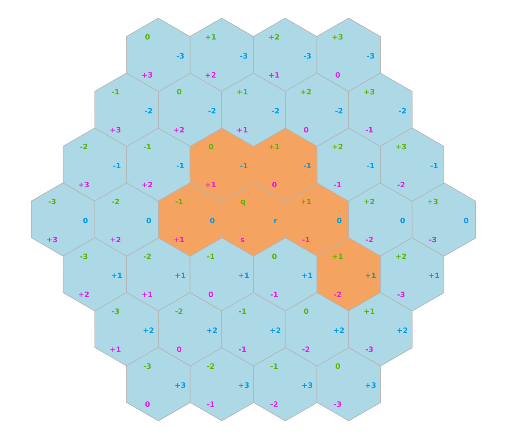

<!-- Back to Top -->
<a name="readme-top"></a>

<!-- Shields -->
[![LinkedIn][linkedin-shield]][linkedin-url]

<!-- Logo -->
<br/>
<div align="center">
    
    <h3>Hexe</h3>
    <p>
    An easy-to-use golang library for working with hexagonal grids.
    <br/>
    <a href="www.google.com"><strong>Explore the docs »</strong></a>
    </p>
</div>

<!-- Table of Contents -->
<details>
	<summary>Table of Contents</summary>
	<ol>
		<li>
			<a href="#about-the-project">About The Project</a>
		</li>
		<li>
			<a href="#getting-started">Getting Started</a>
			<ul>
				<li><a href="#prerequisites">Prerequisites</a></li>
				<li><a href="#installation">Installation</a></li>
			</ul>
		</li>
		<li>
			<a href="#features">Features</a>
		</li>
		<li>
			<a href="#math-functions">Math Functions</a>
		</li>
		<li>
			<a href="#coordinates">Coordinates</a>
			<ul>
				<li><a href="#instantiation">Instantiation</a></li>
				<li><a href="#sets">Sets</a></li>
			</ul>
		</li>
		<li>
			<a href="#visualization">Visualization</a>
		</li>
	</ol>
</details>


## About The Project
As part of a side-project, I needed a robust library for working with hexagonal grids in Go, but didn't find
anything great, so, I decided to implement my own.  I stumbled on this [great guide](https://www.redblobgames.com/grids/hexagons)
that covers just about everything you could want to know about hexagonal grids and algorithms for them.  This project is
an implementation of that guide as an easy-to-use Go library. 

<p align="right">(<a href="#readme-top">back to top</a>)</p>

## Getting Started

### Prerequisites
This library was written with Go 1.22.3 and uses some of its experimental libraries.  You will need a compatible
version of Go.

### Installation
The library can be installed the usual way with go modules:
```sh
go get -u github.com/legendary-code/hexe
```

<p align="right">(<a href="#readme-top">back to top</a>)</p>

## Features
These are the features currently supported by this library:
- Coordinate systems
  - axial
  - cube
  - double-height
  - double-width
  - even-q
  - even-r
  - odd-q
  - odd-r
- Orientations
  - pointy-top
  - flat-top
- Cube coordinate math functions
- Coordinate functions
  - Neighbors
  - Movement Range
  - Set Operations
  - Lines
  - Rings
  - Tracing
  - Field of View
  - Path Finding
- Grid with load/save functionality

<p style="text-align: right">(<a href="#readme-top">back to top</a>)</p>

## Math Functions
This library provides basic math functions for cubic coordinates, which are then used by the rest of the library.  This
is a less common use-case, but, is available if needed.

Example:

https://github.com/legendary-code/hexe/blob/main/examples/math_functions.go
```go
package main

import (
	"fmt"
	"github.com/legendary-code/hexe/pkg/hexe/math"
)

func mathFunctionsExample() {
	distance := math.CubeDistance(0, 1, -1, 0, 2, -2)
	fmt.Printf("The distance from (0, 1, -1) to (0, 2, -2) is %d", distance)
}
```


<p align="right">(<a href="#readme-top">back to top</a>)</p>

## Coordinates
This is the most common usage of this library, working directly with coordinates and sets of coordinates.

### Instantiation

https://github.com/legendary-code/hexe/blob/main/examples/instantiation.go
```go
package main

import (
	"fmt"
	"github.com/legendary-code/hexe/pkg/hexe/coord"
)

func instantiationExample() {
	// new axial coordinate (0, 1)
	a := coord.NewAxial(0, 1)

	// convert to cube coordinates (0, 1, -1)
	c := a.Cube()

	// zero value
	c = coord.ZeroCube()

	// accessing components
	fmt.Println(c.Q(), c.R(), c.S())
}
```


### Sets
Some functions return a set of coordinates, you can easily work with multiple coordinates

https://github.com/legendary-code/hexe/blob/main/examples/sets.go
```go
package main

import (
	"fmt"
	"github.com/legendary-code/hexe/pkg/hexe/coord"
)

func setsExample() {
	// Create a set of axial coordinates
	a := coord.Axials{
		coord.NewAxial(0, 0),
		coord.NewAxial(0, 1),
		coord.NewAxial(1, 0),
		coord.NewAxial(1, 1),
	}

	// Convert them to cube coordinates
	c := a.Cubes()

	// You can iterate over them
	for _, v := range c {
		fmt.Println(v)
	}
}
```


<p align="right">(<a href="#readme-top">back to top</a>)</p>

## Visualization
To help visualize hex grids generated in code, simple plotting functionality
is provided for drawing hex grid coordinates and styling the cells.

https://github.com/legendary-code/hexe/blob/main/examples/plot.go
```go
package main

import (
	"github.com/legendary-code/hexe/pkg/hexe/coord"
	"github.com/legendary-code/hexe/pkg/hexe/plot"
	"github.com/legendary-code/hexe/pkg/hexe/plot/style"
	"golang.org/x/image/colornames"
)

func plotExample() {
	fig := plot.NewFigure()

	center := coord.NewAxial(0, 0)
	grid := center.MovementRange(3)

	waterStyle := style.Color(colornames.Lightblue).FontSize(40).Name("🌊")
	landStyle := style.Color(colornames.Sandybrown).FontSize(40).Name("🏝️")

	fig.AddStyledCoords(
		grid,
		waterStyle,
	)

	fig.AddStyledCoords(
		coord.Axials{
			coord.NewAxial(0, 0),
			coord.NewAxial(1, 0),
			coord.NewAxial(1, -1),
			coord.NewAxial(0, -1),
			coord.NewAxial(-1, 0),
		},
		landStyle,
	)

	fig.AddStyledCoord(
		coord.NewAxial(1, 1),
		landStyle.Name("🏖️"),
	)

	_ = fig.RenderFile("../images/plot.svg")
}
```
#### Output:



<p align="right">(<a href="#readme-top">back to top</a>)</p>

<!-- Links & Images -->
[linkedin-shield]: https://img.shields.io/badge/LinkedIn-blue?style=social&logo=linkedin
[linkedin-url]: https://www.linkedin.com/in/gene-heinrich-6192064/
