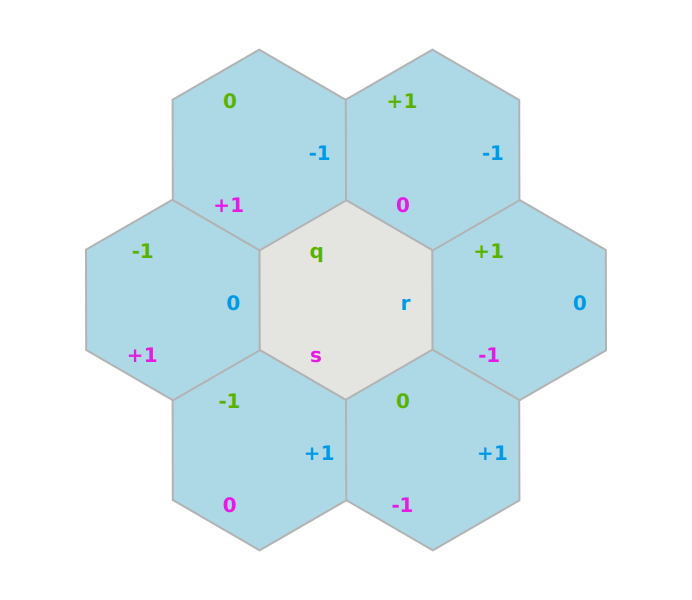
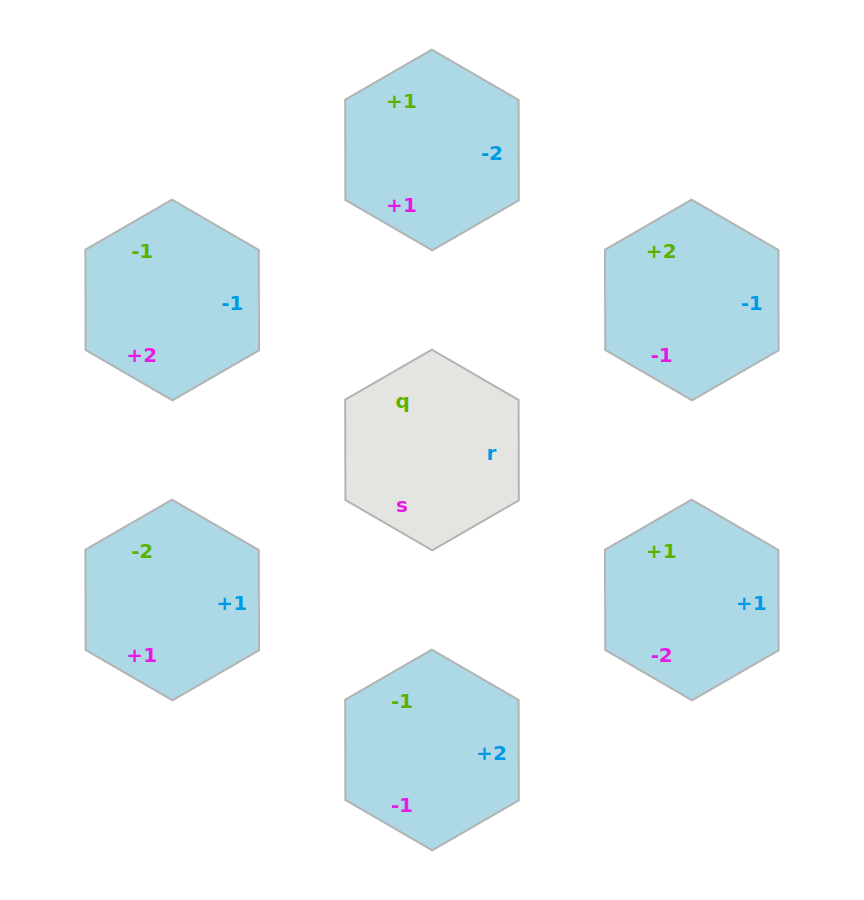
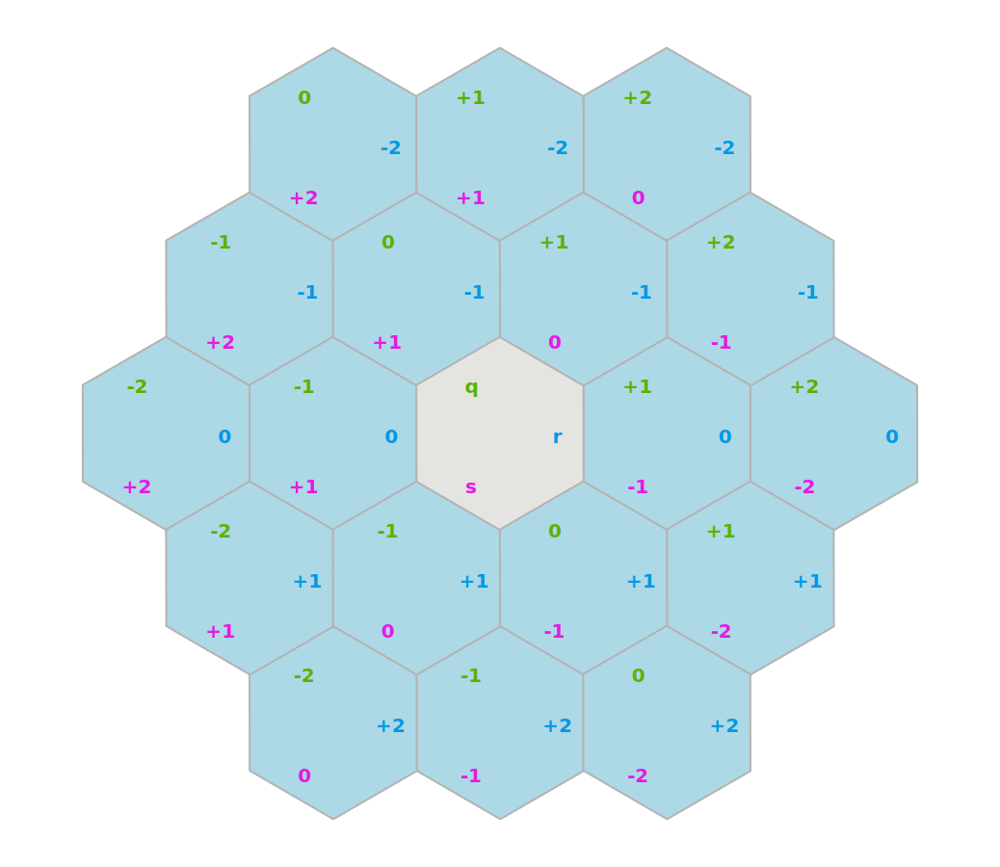
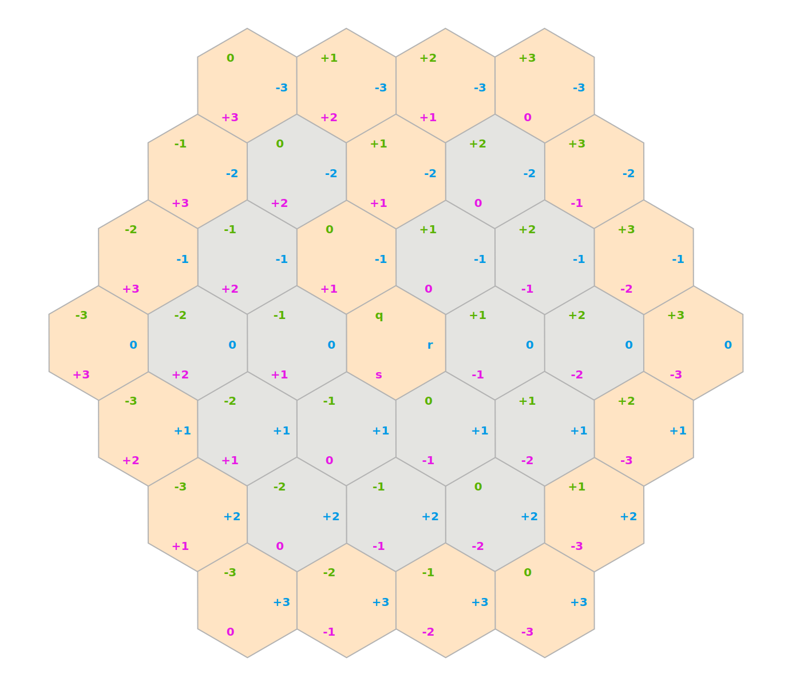
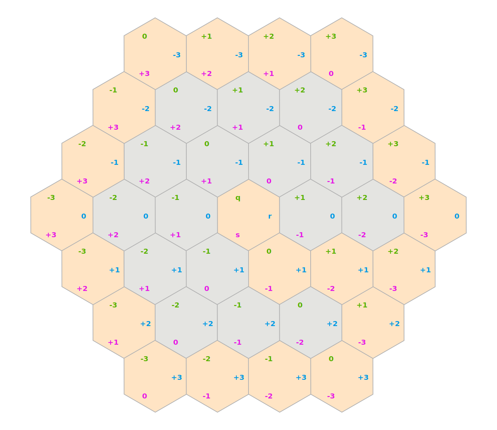
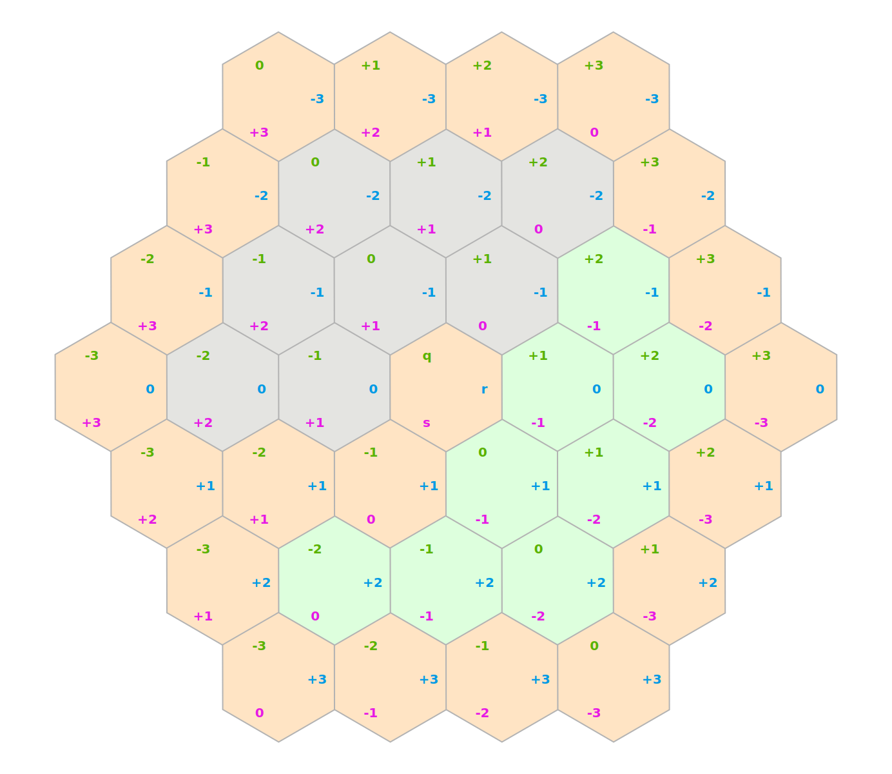
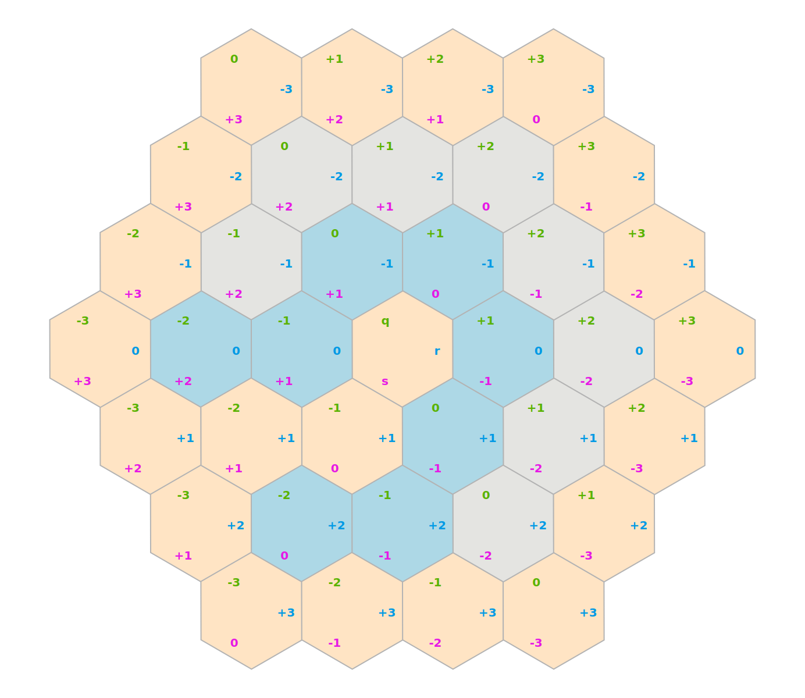

<!-- Back to Top -->
<a name="readme-top"></a>

<!-- Shields -->
[![LinkedIn][linkedin-shield]][linkedin-url]

<!-- Logo -->
<br/>
<div align="center">
    
    <h3>Hexe</h3>
    <p>
    An easy-to-use golang library for working with hexagonal grids.
    <br/>
    <a href="https://pkg.go.dev/legendary-code/hexe"><strong>Explore the docs »</strong></a>
    </p>
</div>

<!-- Table of Contents -->
<details>
	<summary>Table of Contents</summary>
	<ol>
		<li>
			<a href="#about-the-project">About The Project</a>
		</li>
		<li>
			<a href="#getting-started">Getting Started</a>
			<ul>
				<li><a href="#prerequisites">Prerequisites</a></li>
				<li><a href="#installation">Installation</a></li>
			</ul>
		</li>
		<li>
			<a href="#features">Features</a>
		</li>
		<li>
			<a href="#math-functions">Math Functions</a>
		</li>
		<li>
			<a href="#coordinates">Coordinates</a>
			<ul>
				<li><a href="#instantiation">Instantiation</a></li>
				<li><a href="#sets">Sets</a></li>
				<li><a href="#visualization">Visualization</a></li>
				<li><a href="#neighbors">Neighbors</a></li>
				<li><a href="#diagonal-neighbors">Diagonal Neighbors</a></li>
				<li><a href="#movement-range">Movement Range</a></li>
				<li><a href="#line">Line</a></li>
				<li><a href="#trace">Trace</a></li>
				<li><a href="#flood-fill">Flood Fill</a></li>
				<li><a href="#rotate">Rotate</a></li>
				<li><a href="#reflect">Reflect</a></li>
				<li><a href="#ring">Ring</a></li>
				<li><a href="#field-of-view">Field Of View</a></li>
				<li><a href="#find-path---breadth-first-search">Find Path - Breadth First Search</a></li>
			</ul>
		</li>
		<li>
			<a href="#grid">Grid</a>
			<ul>
				<li><a href="#grid-operations">Grid Operations</a></li>
				<li><a href="#grid-persistence">Grid Persistence</a></li>
			</ul>
		</li>
		<li>
			<a href="#more-examples">More Examples</a>
		</li>
		<li>
			<a href="#license">License</a>
		</li>
		<li>
			<a href="#contributing">Contributing</a>
		</li>
	</ol>
</details>


## About The Project
As part of a side-project, I needed a robust library for working with hexagonal grids in Go, but didn't find
anything great, so, I decided to implement my own.  I stumbled on this [great guide](https://www.redblobgames.com/grids/hexagons)
that covers just about everything you could want to know about hexagonal grids and algorithms for them.  This project is
an implementation of that guide as an easy-to-use Go library. 

<p align="right">(<a href="#readme-top">back to top</a>)</p>

## Getting Started

### Prerequisites
This library was written with heavy use of generics and some experimental go modules.  Your project will require at 
least Go 1.22.3 installed.

### Installation
The library can be installed the usual way with go modules:
```sh
go get -u github.com/legendary-code/hexe
```

<p align="right">(<a href="#readme-top">back to top</a>)</p>

## Features
These are the features currently supported by this library:
- Coordinate systems
  - axial
  - cube
  - double-height
  - double-width
  - even-q
  - even-r
  - odd-q
  - odd-r
- Orientations
  - pointy-top
  - flat-top
- Cube coordinate math functions
- Coordinate functions
  - Neighbors
  - Movement Range
  - Set Operations
  - Lines
  - Rings
  - Tracing
  - Field of View
  - Path Finding
- Grid with load/save functionality

<p style="text-align: right">(<a href="#readme-top">back to top</a>)</p>

## Math Functions
This library provides basic math functions for cubic coordinates, which are then used by the rest of the library.  This
is a less common use-case, but, is available if needed.

Example:

[math_functions.go](https://github.com/legendary-code/hexe/blob/main/examples/math_functions.go)
```go
package main

import (
	"fmt"
	"github.com/legendary-code/hexe/pkg/hexe/math"
)

func mathFunctionsExample() {
	distance := math.CubeDistance(0, 1, -1, 0, 2, -2)
	fmt.Printf("The distance from (0, 1, -1) to (0, 2, -2) is %d\n", distance)
}
```


<p align="right">(<a href="#readme-top">back to top</a>)</p>

## Coordinates
This is the most common usage of this library, working directly with coordinates and sets of coordinates.

### Instantiation

[instantiation.go](https://github.com/legendary-code/hexe/blob/main/examples/instantiation.go)
```go
package main

import (
	"fmt"
	"github.com/legendary-code/hexe/pkg/hexe/coord"
)

func instantiationExample() {
	// new axial coordinate (0, 1)
	a := coord.NewAxial(0, 1)

	// convert to cube coordinates (0, 1, -1)
	c := a.Cube()
	fmt.Println(c.Q(), c.R(), c.S())

	// zero value
	c = coord.ZeroCube()

	// accessing components
	fmt.Println(c.Q(), c.R(), c.S())
}
```


### Sets
Some functions return a set of coordinates, which you can easily work with

[sets.go](https://github.com/legendary-code/hexe/blob/main/examples/sets.go)
```go
package main

import (
	"fmt"
	"github.com/legendary-code/hexe/pkg/hexe/coord"
)

func setsExample() {
	// Create a set of axial coordinates
	a := coord.NewAxials(
		coord.NewAxial(0, 0),
		coord.NewAxial(0, 1),
		coord.NewAxial(1, 0),
		coord.NewAxial(1, 1),
	)

	// Convert them to cube coordinates
	c := a.Cubes()

	// You can iterate over them
	for iter := c.Iterator(); iter.Next(); {
		fmt.Println(iter.Item())
	}

	// Another way to iterate
	c.ForEach(func(v coord.Cube) bool {
		fmt.Println(v)
		return true
	})
}
```


<p align="right">(<a href="#readme-top">back to top</a>)</p>

### Visualization
To help visualize hex grids generated in code, simple plotting functionality
is provided for drawing hex grid coordinates and styling the cells.

[plot.go](https://github.com/legendary-code/hexe/blob/main/examples/plot.go)
```go
package main

import (
	"github.com/legendary-code/hexe/pkg/hexe/coord"
	"github.com/legendary-code/hexe/pkg/hexe/plot"
	"github.com/legendary-code/hexe/pkg/hexe/plot/style"
	"golang.org/x/image/colornames"
)

func plotExample() {
	fig := plot.NewFigure()

	center := coord.NewAxial(0, 0)
	grid := center.MovementRange(3)

	waterStyle := style.Color(colornames.Lightblue).FontSize(40).Name("🌊")
	landStyle := style.Color(colornames.Sandybrown).FontSize(40).Name("🏝️")

	fig.AddStyledCoords(
		grid,
		waterStyle,
	)

	fig.AddStyledCoords(
		coord.NewAxials(
			coord.NewAxial(0, 0),
			coord.NewAxial(1, 0),
			coord.NewAxial(1, -1),
			coord.NewAxial(0, -1),
			coord.NewAxial(-1, 0),
		),
		landStyle,
	)

	fig.AddStyledCoord(
		coord.NewAxial(1, 1),
		landStyle.Name("🏖️"),
	)

	_ = fig.RenderFile("images/plot.svg")
}
```
#### Output:


### Neighbors
You can calculate neighbors of a coordinate

[neighbors.go](https://github.com/legendary-code/hexe/blob/main/examples/neighbors.go)
```go
package main

import (
	"github.com/legendary-code/hexe/pkg/hexe/coord"
	"github.com/legendary-code/hexe/pkg/hexe/plot"
	"github.com/legendary-code/hexe/pkg/hexe/plot/style"
	"golang.org/x/image/colornames"
)

func neighborsExample() {
	fig := plot.NewFigure()

	center := coord.ZeroAxial()
	neighbors := center.Neighbors()

	fig.AddStyledCoords(neighbors, style.Color(colornames.Lightblue))
	fig.AddCoord(center)

	_ = fig.RenderFile("images/neighbors.svg")
}
```
#### Output:



### Diagonal Neighbors
This library also supports diagonal neighbors of a coordinate

[diagonal_neighbors.go](https://github.com/legendary-code/hexe/blob/main/examples/diagonal_neighbors.go)
```go
package main

import (
	"github.com/legendary-code/hexe/pkg/hexe/coord"
	"github.com/legendary-code/hexe/pkg/hexe/plot"
	"github.com/legendary-code/hexe/pkg/hexe/plot/style"
	"golang.org/x/image/colornames"
)

func diagonalNeighborsExample() {
	fig := plot.NewFigure()

	center := coord.ZeroAxial()
	neighbors := center.DiagonalNeighbors()

	fig.AddStyledCoords(neighbors, style.Color(colornames.Lightblue))
	fig.AddCoord(center)

	_ = fig.RenderFile("images/diagonal_neighbors.svg")
}
```
#### Output:



### Movement Range
Using the movement range on a coord returns all the coordinates that can be reached into a given number of steps

[movement_range.go](https://github.com/legendary-code/hexe/blob/main/examples/movement_range.go)
```go
package main

import (
	"github.com/legendary-code/hexe/pkg/hexe/coord"
	"github.com/legendary-code/hexe/pkg/hexe/plot"
	"github.com/legendary-code/hexe/pkg/hexe/plot/style"
	"golang.org/x/image/colornames"
)

func movementRangeExample() {
	fig := plot.NewFigure()

	center := coord.ZeroAxial()
	movementRange := center.MovementRange(2)

	fig.AddStyledCoords(movementRange, style.Color(colornames.Lightblue))
	fig.AddCoord(center)

	_ = fig.RenderFile("images/movement_range.svg")
}
```
#### Output:



### Line
Drawing lines is supported as well

[line_to.go](https://github.com/legendary-code/hexe/blob/main/examples/line_to.go)
```go
package main

import (
	"github.com/legendary-code/hexe/pkg/hexe/coord"
	"github.com/legendary-code/hexe/pkg/hexe/plot"
	"github.com/legendary-code/hexe/pkg/hexe/plot/style"
	"golang.org/x/image/colornames"
)

func lineToExample() {
	fig := plot.NewFigure()

	grid := coord.ZeroAxial().MovementRange(3)
	from := coord.NewAxial(-1, -1)
	to := coord.NewAxial(2, 0)
	line := from.LineTo(to)

	fig.AddCoords(grid)
	fig.AddStyledCoords(line, style.Color(colornames.Lightgreen))

	_ = fig.RenderFile("images/line_to.svg")
}
```
#### Output:


### Trace
Trace draws a line but with collision detection

[trace_to.go](https://github.com/legendary-code/hexe/blob/main/examples/trace_to.go)
```go
package main

import (
	"github.com/legendary-code/hexe/pkg/hexe/coord"
	"github.com/legendary-code/hexe/pkg/hexe/plot"
	"github.com/legendary-code/hexe/pkg/hexe/plot/style"
	"golang.org/x/image/colornames"
)

func traceToExample() {
	fig := plot.NewFigure()

	grid, walls := createArena()
	from := coord.NewAxial(-1, -1)
	to := coord.NewAxial(0, 2)
	trace := from.TraceTo(to, walls.Contains)

	fig.AddCoords(grid)
	fig.AddStyledCoords(walls, style.Color(colornames.Bisque))
	fig.AddStyledCoords(trace, style.Color(colornames.Lightgreen))

	_ = fig.RenderFile("images/trace_to.svg")
}
```
#### Output:


### Flood Fill
Flood fill tries to fill an area up to a maximum radius, taking into account blocked areas

[flood_fill.go](https://github.com/legendary-code/hexe/blob/main/examples/flood_fill.go)
```go
package main

import (
	"github.com/legendary-code/hexe/pkg/hexe/coord"
	"github.com/legendary-code/hexe/pkg/hexe/plot"
	"github.com/legendary-code/hexe/pkg/hexe/plot/style"
	"golang.org/x/image/colornames"
)

func floodFillExample() {
	fig := plot.NewFigure()

	grid, walls := createArena()
	center := coord.NewAxial(-1, -1)
	fill := center.FloodFill(3, walls.Contains)

	fig.AddCoords(grid)
	fig.AddStyledCoords(walls, style.Color(colornames.Bisque))
	fig.AddStyledCoords(fill, style.Color(colornames.Lightgreen))

	_ = fig.RenderFile("images/flood_fill.svg")
}
```
#### Output:


### Rotate
You can rotate single coordinates or a set of coordinates around a center in 60-degree increments

[rotate.go](https://github.com/legendary-code/hexe/blob/main/examples/rotate.go)
```go
package main

import (
	"github.com/legendary-code/hexe/pkg/hexe/coord"
	"github.com/legendary-code/hexe/pkg/hexe/plot"
	"github.com/legendary-code/hexe/pkg/hexe/plot/style"
	"golang.org/x/image/colornames"
)

func rotateExample() {
	fig := plot.NewFigure()

	grid, walls := createArena()
	walls = walls.Rotate(coord.ZeroAxial(), 2)

	fig.AddCoords(grid)
	fig.AddStyledCoords(walls, style.Color(colornames.Bisque))

	_ = fig.RenderFile("images/rotate.svg")
}
```
#### Output:



### Reflect
You can reflect a coordinate or set of coordinates across the Q, R, or S axis

[reflect.go](https://github.com/legendary-code/hexe/blob/main/examples/reflect.go)
```go
package main

import (
	"github.com/legendary-code/hexe/pkg/hexe/plot"
	"github.com/legendary-code/hexe/pkg/hexe/plot/style"
	"golang.org/x/image/colornames"
)

func reflectExample() {
	fig := plot.NewFigure()

	grid, walls := createArena()
	walls = walls.ReflectR()

	fig.AddCoords(grid)
	fig.AddStyledCoords(walls, style.Color(colornames.Bisque))

	_ = fig.RenderFile("images/reflect.svg")
}
```
#### Output:



### Ring
You can generate rings of various radii

[ring.go](https://github.com/legendary-code/hexe/blob/main/examples/ring.go)
```go
package main

import (
	"github.com/legendary-code/hexe/pkg/hexe/coord"
	"github.com/legendary-code/hexe/pkg/hexe/plot"
	"github.com/legendary-code/hexe/pkg/hexe/plot/style"
	"golang.org/x/image/colornames"
)

func ringExample() {
	fig := plot.NewFigure()

	grid, walls := createArena()
	walls = walls.ReflectR()
	ring := coord.ZeroAxial().Ring(1)

	fig.AddCoords(grid)
	fig.AddStyledCoords(walls, style.Color(colornames.Bisque))
	fig.AddStyledCoords(ring, style.Color(colornames.Lightcoral))

	_ = fig.RenderFile("images/ring.svg")
}
```
#### Output:


### Field Of View
Field of view casts out rays in all directions from a given coordinate to generate the cells visible from the location

[field_of_view.go](https://github.com/legendary-code/hexe/blob/main/examples/field_of_view.go)
```go
package main

import (
	"github.com/legendary-code/hexe/pkg/hexe/coord"
	"github.com/legendary-code/hexe/pkg/hexe/plot"
	"github.com/legendary-code/hexe/pkg/hexe/plot/style"
	"golang.org/x/image/colornames"
	"image/color"
)

func fieldOfViewExample() {
	fig := plot.NewFigure()
	grid, walls := createArena()

	person := coord.NewAxial(-1, 2)
	fov := person.FieldOfView(3, walls.Contains)

	wallStyle := style.Color(colornames.Bisque)
	fovStyle := style.Color(color.RGBA{R: 0xdd, G: 0xff, B: 0xdd, A: 0xff})
	personStyle := fovStyle.FontSize(40).Name("🧍")

	fig.AddCoords(grid)
	fig.AddStyledCoords(walls, wallStyle)
	fig.AddStyledCoords(fov, fovStyle)
	fig.AddStyledCoord(person, personStyle)

	_ = fig.RenderFile("images/field_of_view.svg")
}
```
#### Output:



### Find Path - Breadth First Search
You can perform basic pathfinding with the breadth first search functionality

[find_path_bfs.go](https://github.com/legendary-code/hexe/blob/main/examples/find_path_bfs.go)
```go
package main

import (
	"github.com/legendary-code/hexe/pkg/hexe/coord"
	"github.com/legendary-code/hexe/pkg/hexe/plot"
	"github.com/legendary-code/hexe/pkg/hexe/plot/style"
	"golang.org/x/image/colornames"
)

func findPathBfsExample() {
	fig := plot.NewFigure()
	grid, walls := createArena()

	person := coord.NewAxial(-2, 0)
	target := coord.NewAxial(-2, 2)
	path := person.FindPathBFS(target, 20, walls.Contains)

	wallStyle := style.Color(colornames.Bisque)
	pathStyle := style.Color(colornames.Lightblue).FontSize(40)
	personStyle := pathStyle.Name("🧍")
	targetStyle := pathStyle.Name("❌")

	fig.AddCoords(grid)
	fig.AddStyledCoords(walls, wallStyle)
	fig.AddStyledCoords(path, pathStyle)
	fig.AddStyledCoord(person, personStyle)
	fig.AddStyledCoord(target, targetStyle)

	_ = fig.RenderFile("images/find_path_bfs.svg")
}
```
#### Output:



<p align="right">(<a href="#readme-top">back to top</a>)</p>

## Grid
The library also provides a basic `Grid[C coords.Coord]` collection type for storing and querying values by coordinates.

### Grid Operations
[grid.go](https://github.com/legendary-code/hexe/blob/main/examples/grid.go)
```go
package main

import (
	"fmt"
	"github.com/legendary-code/hexe/pkg/hexe"
	"github.com/legendary-code/hexe/pkg/hexe/coord"
)

func gridExample() {
	grid := hexe.NewAxialGrid[string]()

	// set some values
	coords := coord.ZeroAxial().MovementRange(2)
	for i := coords.Iterator(); i.Next(); {
		c := i.Item()
		grid.Set(c, fmt.Sprintf("%d", c.Q()+c.R()))
	}

	// remove the center value
	grid.Delete(coord.ZeroAxial())

	// get values for a line
	line := coord.NewAxial(1, 1).LineTo(coord.NewAxial(-1, -1))
	values := grid.GetAll(line)

	// print it out
	for c, value := range values {
		fmt.Printf("%v => %s\n", c, value)
	}
}
```


### Grid Persistence
You can also persist and load grids to any `io.Writer`/`io.Reader`

[grid_persistence.go](https://github.com/legendary-code/hexe/blob/main/examples/grid_persistence.go)
```go
package main

import (
	"fmt"
	"github.com/legendary-code/hexe/pkg/hexe"
	"github.com/legendary-code/hexe/pkg/hexe/coord"
	"strings"
)

type StringEncoderDecoder struct {
}

func (s *StringEncoderDecoder) Encode(value string) ([]byte, error) {
	return []byte(value), nil
}

func (s *StringEncoderDecoder) Decode(bytes []byte) (string, error) {
	return string(bytes), nil
}

func gridPersistenceExample() {
	codec := &StringEncoderDecoder{}
	grid := hexe.NewAxialGrid[string](
		hexe.WithEncoderDecoder[string](codec),
	)

	grid.Set(coord.NewAxial(0, 1), "foo")
	grid.Set(coord.NewAxial(1, 0), "bar")

	sb := strings.Builder{}

	err := grid.Encode(&sb)
	if err != nil {
		panic(err)
	}

	grid.Clear()

	r := strings.NewReader(sb.String())
	err = grid.Decode(r)
	if err != nil {
		panic(err)
	}

	for i := grid.Iterator(); i.Next(); {
		fmt.Printf("%v => %s\n", i.Index(), i.Item())
	}
}
```


<p align="right">(<a href="#readme-top">back to top</a>)</p>

## More Examples
For more examples of various features, check out [./examples](./examples)

## License
This library uses the [MIT License](./LICENSE)

## Contributing
Please see [./CONTRIBUTING](./CONTRIBUTING) for guidlines.

<!-- Links & Images -->
[linkedin-shield]: https://img.shields.io/badge/LinkedIn-blue?style=social&logo=linkedin
[linkedin-url]: https://www.linkedin.com/in/gene-heinrich-6192064/
